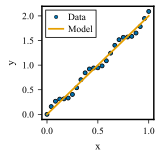
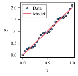
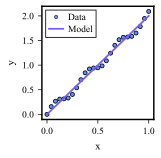

# Gallery

These examples use the same synthetic data, Science single-column dimensions and Times New Roman typography. Only the categorical palette changes. The SVGs preserve vector paths and use a white figure background in both website themes.

## Okabe–Ito

The default eight-colour palette.



## Paul Tol bright

A seven-colour palette for categorical series.



## IBM

A five-colour palette for categorical series.



## Reproduce a figure

Change `palette_name` to `"okabe-ito"`, `"paul-tol-bright"` or `"ibm"`:

```python
import numpy as np
import matplotlib.pyplot as plt
import hedgehogs as hdg

palette_name = "okabe-ito"
size = hdg.figsize("science", "single")
hdg.set_style(figure_size=size, palette=palette_name)
colours = hdg.get_palette(palette_name)
x = np.linspace(0, 1, 25)
y = 2 * x + 0.1 * np.sin(20 * x)

fig, ax = plt.subplots(figsize=size)
ax.scatter(x, y, color=colours[0], label="Data")
ax.plot(x, 2 * x, color=colours[1], label="Model")
ax.set(xlabel="x", ylabel="y")
ax.legend()
hdg.plots.save("example.svg", fig=fig, bbox_inches=None)
hdg.plots.show(fig=fig)
```

The website scales previews for screen reading; their saved canvas is 2.24 × 2.20 inches. Judge text size at the final document width. Explore all [palette swatches](api/palettes.md#built-in-palettes) and [journal dimensions](api/figures.md#figsize) in the API references.

Gallery assets are generated explicitly with [the gallery script](../tools/docs/gallery.py). Fonts, backends and library versions can affect placement; these examples show the committed source's output rather than a cross-environment pixel guarantee.
