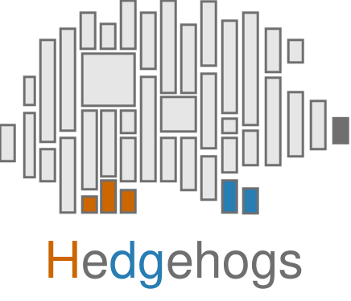

  

# Scientific figures and reports

Hedgehogs prepares Matplotlib figures and presents tables, progress and status messages in notebooks and terminals. Draw with Matplotlib, then finish and export with Hedgehogs.

[Install Hedgehogs](installation.md) · [Draw a first figure](quick-start.md) · [Browse the gallery](gallery.md)

## Choose a task

| Task | Start here |
| --- | --- |
| Set figure dimensions, typography and helpers | [Figures](api/figures.md) |
| Finish, display or save a plot | [Plots](api/plots.md) |
| Choose colours and series styles | [Palettes](api/palettes.md) |
| Report values and export tables | [Tables](api/tables.md) |
| Show progress and terminal messages | [Terminal and progress](api/terminal.md) |

## Presentation behaviour

Matplotlib remains the reference for artist behaviour. Hedgehogs adjusts supported layout and legend placement while retaining editable Matplotlib objects. Fonts, backends, figure dimensions and library versions can affect the result; identical placement across different environments is not guaranteed. Finishing preserves vector output unless rasterisation is explicitly requested. See the [presentation rules](developer/presentation.md#legend-fitting-and-limits) for the contract and limits.

The [source revision](versions.md) identifies the documentation build. For changes to the package, consult the [changelog](../CHANGELOG.md).
